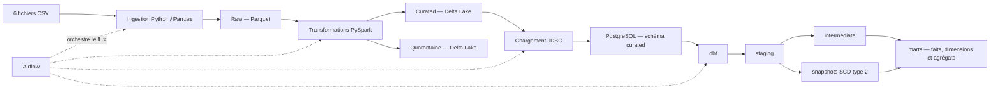

# AfriShop — plateforme de données e-commerce

AfriShop est un projet pédagogique de Data Engineering qui centralise des exports d'une marketplace e-commerce panafricaine, contrôle leur qualité et prépare des données pour l'analyse. La plateforme s'exécute localement avec Docker Compose et met en œuvre un flux de type Lakehouse : **raw → curated → analytics**.

## Objectifs

- Traiter les exports de commandes, lignes de commande, clients, produits, paiements et livraisons.
- Conserver les données brutes avec leur date d'arrivée et leur fichier source.
- Nettoyer et contrôler les données avec PySpark, puis isoler les enregistrements non conformes.
- Charger les tables curated dans PostgreSQL et construire des modèles analytiques avec dbt.
- Orchestrer le traitement quotidien avec Apache Airflow.
- Historiser certaines évolutions des clients et des produits et calculer des agrégats analytiques incrémentaux.

## Architecture



### Composants

| Composant | Rôle |
|---|---|
| Apache Airflow | Planifie et orchestre le DAG quotidien, ses dépendances et ses reprises. |
| Python et Pandas | Lisent les fichiers CSV et préparent la zone raw. |
| Apache Spark | Applique les transformations et contrôles de la zone curated. |
| Delta Lake | Stocke les tables curated et la quarantaine, avec des mises à jour par clé. |
| PostgreSQL | Reçoit les tables curated et héberge les modèles dbt. |
| dbt Core / dbt-postgres | Construit les vues, snapshots, faits, dimensions et agrégats analytiques. |
| Docker Compose et Redis | Fournissent l'environnement local des services ; Redis sert de broker à Airflow Celery. |
| MinIO | Service optionnel du fichier Compose ; le pipeline actuel utilise les répertoires locaux montés, pas MinIO. |

> **Mode Spark :** les services Spark master/worker sont déclarés dans Compose, mais le DAG vide `SPARK_MASTER_URL` pour exécuter les tâches Spark en mode local dans la configuration actuelle.

## Structure du dépôt

```text
.
├── dags/                       # DAG Airflow
├── data/raw/                   # Fichiers CSV d'entrée
├── dbt/
│   ├── models/staging/         # Modèles de préparation
│   ├── models/intermediate/    # Transformations métier intermédiaires
│   ├── models/marts/           # Faits, dimensions et agrégats
│   └── snapshots/              # Historisation des clients et produits
├── docs/                       # Documentation technique et livrables
├── infra/
│   ├── airflow/                # Image Airflow et dépendances
│   ├── postgres/               # Initialisation des bases et schémas
│   └── spark/                  # Image Spark
├── src/
│   ├── curated/                # Jobs PySpark par domaine
│   ├── ingest_raw.py           # Ingestion CSV vers Parquet
│   └── load_to_postgres.py     # Chargement Delta vers PostgreSQL
├── tests/                      # Tests Python
├── docker-compose.yml
├── Makefile
└── requirements.txt
```

## Pré-requis

- Docker Engine et Docker Compose v2 (`docker compose`).
- GNU Make.
- Ressources suffisantes pour construire et lancer Airflow, PostgreSQL, Redis et Spark.
- Les fichiers CSV attendus dans `data/raw/`.

Le projet s'exécute dans les conteneurs. Les dépendances Python de la pile sont installées dans l'image Airflow, avec des environnements séparés pour dbt et Great Expectations.

## Démarrage local

1. Initialiser la configuration et les répertoires :

   ```bash
   make init
   ```

   Cette commande crée `.env` à partir de `.env.example` s'il n'existe pas et génère les clés Airflow manquantes.

2. **Avant de démarrer**, modifier `.env` et remplacer les mots de passe d'exemple (`change_me`) par des valeurs locales non triviales. Renseigner également un `PII_HASH_SALT` privé et non vide pour pouvoir traiter les clients. Ne jamais versionner ou partager `.env`.

3. Construire et démarrer les services :

   ```bash
   make up
   ```

4. Vérifier l'état des conteneurs :

   ```bash
   docker compose ps
   ```

5. Ouvrir Airflow a `http://localhost:8080`, avec les identifiants definis dans `.env`. Le DAG est cree en pause : il faut l'activer dans l'interface avant de le lancer.

Pour démarrer aussi MinIO, qui est optionnel et n'est pas utilisé par le flux de données actuel :

```bash
docker compose --profile minio up -d --build
```

L'API et la console MinIO sont exposées par défaut sur les ports définis par `MINIO_API_PORT` et `MINIO_CONSOLE_PORT`.

## Exécution du pipeline

Le DAG `afrishop_daily_pipeline` s'exécute quotidiennement lorsqu'il est activé. Son ordre est :

1. `ingest_raw` : lecture des CSV et écriture Parquet dans raw.
2. `curated_products`, `curated_customers`, `curated_orders`, `curated_order_lines`, `curated_payments`, `curated_deliveries` : transformations Spark séquentielles.
3. `load_postgres` : chargement des tables Delta dans le schéma PostgreSQL `curated`.
4. `dbt_staging` : exécution des modèles staging et intermediate.
5. `dbt_snapshot` : historisation des changements client et produit.
6. `dbt_marts` : construction des tables analytiques.
7. `dbt_test` : contrôles dbt.

Les jobs curated peuvent aussi être déclenchés indépendamment dans le conteneur Airflow, depuis le répertoire du projet :

```bash
docker compose exec airflow-worker bash -lc \
  'cd /opt/airflow && python -m curated.products'
```

Remplacer `products` par `customers`, `orders`, `order_lines`, `payments` ou `deliveries` pour sélectionner un autre traitement. Le job clients nécessite un `PII_HASH_SALT` configuré. Le job des lignes de commande vérifie les identifiants dans la source produits.

Pour déclencher le DAG avec Make :

```bash
make seed
```

## Zones de données et règles métier

### Raw

`src/ingest_raw.py` lit les six fichiers :

```text
data/raw/orders.csv
data/raw/order_lines.csv
data/raw/customers.csv
data/raw/products.csv
data/raw/payments.csv
data/raw/deliveries.csv
```

Les six CSV sont obligatoires. Ils sont ecrits en Parquet dans `data/lakehouse/raw/<source>/ingestion_date=<date>`. Le script ajoute `_ingested_at` et `_source_file`, remplace la partition lors du rejeu de la meme date et produit un rapport JSON dans `logs/`. Toute source absente fait echouer l ingestion.

### Curated et quarantaine

Les traitements typent les colonnes, dédupliquent les clés métier et appliquent des contrôles propres à chaque domaine. Exemples :

- `orders` : cohérence entre total, sous-total, livraison et remise.
- `order_lines` : existence du produit et cohérence du montant de ligne.
- `products` : mise en quarantaine des prix nuls et indicateur de marge négative.
- `customers` : hachage salé des coordonnées et détection de collisions d'identifiants.
- `deliveries` : vérification de l'ordre chronologique expédition/livraison.
- `payments` : conservation des tentatives de paiement distinctes.

Les données validées sont enregistrées dans `data/lakehouse/curated/<table>`. La quarantaine se trouve dans `data/lakehouse/quarantine/<table>` ; elle est remplacée à chaque exécution et n'est donc pas un historique append-only.

### Modèles dbt

Le projet dbt comprend les sources PostgreSQL curated, des modèles staging et intermediate, deux snapshots SCD type 2 pour les clients et les produits, puis les marts :

- `fact_order_line` : une ligne par ligne de commande.
- Dimensions client, produit, date, moyen de paiement et statut de livraison.
- `agg_customer_rfm` : fréquence, montant et dernière commande par client et devise.
- `agg_product_rotation` : ventes, unités et revenu par produit et mois.
- `agg_category_return_rate` : taux de retour par catégorie et mois.

Les montants restent séparés par devise : aucune conversion monétaire n'est configurée.

## Tests et documentation dbt

Les tests Python sont prévus dans `tests/` et couvrent notamment les règles de transformation et le hachage PII. Le projet contient aussi des tests dbt pour les clés, valeurs autorisées et relations entre modèles.

La commande définie dans le Makefile est :

```bash
make test
```

Elle exécute pytest dans `airflow-worker`. Pour lancer les tests localement, installer les dépendances et rendre `src` importable :

```bash
python -m pip install -r requirements-dev.txt
PYTHONPATH=src python -m pytest -q tests/test_curated_jobs.py tests/test_pii.py
```

> Le service `airflow-worker` monte `tests/` dans `/opt/airflow/tests`; `make test` lance les tests et affiche la couverture.

Pour générer le site et le graphe de dépendances dbt :

```bash
make docs
python3 -m http.server 8085 --directory dbt/target
```

Ouvrir ensuite [http://localhost:8085](http://localhost:8085). Le serveur HTTP est nécessaire pour que la page charge ses fichiers de catalogue.

## Commandes utiles

| Commande | Description |
|---|---|
| `make init` | Initialise `.env` et les répertoires nécessaires. |
| `make up` | Construit et démarre la pile principale. |
| `make up-minio` | Démarre la pile avec le profil MinIO. |
| `make seed` | Déclenche le DAG AfriShop. |
| `make logs` | Suit les journaux Compose. |
| `make test` | Lance pytest dans `airflow-worker` et affiche la couverture avec un seuil de 60 %. |
| `make lint` | Lance Black, isort, Ruff et mypy dans le conteneur. |
| `make fmt` | Formate le code Python dans le conteneur. |
| `make ci` | Enchaine lint, tests et `dbt parse`. |
| `make docs` | Génère la documentation dbt. |
| `make down` | Arrête et supprime les conteneurs, sans supprimer les volumes. |
| `make clean` | Supprime les conteneurs **et les volumes Compose**. |

> **Attention :** `make clean` exécute `docker compose down -v` et supprime notamment les volumes de base de données. Ne l'utiliser que si la perte des données persistées est souhaitée.

## Configuration

Les variables principales sont définies dans `.env.example` :

| Variable | Utilisation |
|---|---|
| `AIRFLOW_WEB_PORT` | Port local de l'interface Airflow. |
| `AIRFLOW_ADMIN_USER`, `AIRFLOW_ADMIN_PASSWORD` | Compte administrateur Airflow initialisé. |
| `POSTGRES_*` | Identifiants de l'instance PostgreSQL. |
| `AIRFLOW_DB_*` | Base et utilisateur de métadonnées Airflow. |
| `WAREHOUSE_DB_*` | Base et utilisateur des tables curated et des modèles dbt. |
| `AIRFLOW_FERNET_KEY`, `AIRFLOW_SECRET_KEY` | Clés de chiffrement et de session Airflow. |
| `DATA_DIR` | Répertoire racine des données (défini à `/data` dans les conteneurs Airflow). |
| `PII_HASH_SALT` | Sel requis pour le hachage des coordonnées client. |
| `SPARK_WORKER_CORES`, `SPARK_WORKER_MEMORY` | Ressources déclarées pour le service Spark worker. |
| `MINIO_*` | Identifiants et ports du service optionnel MinIO. |

La configuration dbt utilise les variables `WAREHOUSE_DB_HOST`, `WAREHOUSE_DB_PORT`, `WAREHOUSE_DB_NAME`, `WAREHOUSE_DB_USER` et `WAREHOUSE_DB_PASSWORD` fournies par l'environnement Compose.

## Données personnelles et précautions

- Les valeurs présentes dans `.env.example` sont des exemples ; les remplacer localement.
- Ne pas publier `.env`, les mots de passe, les clés Airflow ou `PII_HASH_SALT`.
- Le hachage SHA-256 avec sel est stable et sert au rapprochement ; ce n'est ni un chiffrement ni une anonymisation garantie.
- Le sel doit rester secret et identique entre les exécutions qui doivent comparer les mêmes valeurs hachées.
- La quarantaine ne conserve que le dernier état par table ; prévoir un stockage d'audit séparé si un historique des rejets est nécessaire.
- Le projet est pédagogique et doit être audité et renforcé avant tout usage en production.

## Limites connues

- Le code applique des règles de qualité dans Spark et dbt. Bien que Great Expectations soit installé dans un environnement isolé de l'image Airflow, aucune suite d'expectations n'est actuellement intégrée au DAG.
- Les journaux structurés sont présents, mais aucun système de notification externe ni seuil d'alerte n'est configuré.
- MinIO est optionnel et n'est pas le stockage utilisé par les traitements actuels.
- Spark est configuré en mode local par le DAG.
- La documentation dbt indique que les données PostgreSQL utilisées pour certains résultats ont été chargées manuellement depuis les CSV. Les volumes rapportés dans la documentation curated et dbt peuvent correspondre à des états de données différents ; ils ne doivent pas être interprétés comme une réconciliation d'un même run end-to-end.
- Aucun tableau de bord BI n'est inclus.
- Les sources Raw absentes font echouer l ingestion; les six CSV synthetiques doivent etre presents avant le run.
- Les captures Airflow et lineage dbt restent a fournir apres un run de reference.
- Le guide DOCX de presentation mentionne dans d anciennes versions du README n est pas present dans cette copie.

## Documentation complémentaire

- [Guide dbt](docs/dbt_guide.md) — modèles, snapshots, tests et lignage.
- [Pipeline Curated](docs/curated-pipeline.md) — transformations Spark, qualité et quarantaine.
- Le sujet de projet DOCX est a la racine du depot : [Sujet de projet](PROJET%202%20%20%E2%80%94%20Plateforme%20de%20centralisation%20et%20de%20traitement%20analytique%20des%20donn%C3%A9es%20e-commerce%20panafricain.docx).


## Exploitation et livrables

- [Architecture](docs/architecture.md)
- [Runbook](docs/runbook.md)
- [Dictionnaire de donnees](docs/data_dictionary.md)
- [Pipeline Curated](docs/curated-pipeline.md)
- [Guide dbt](docs/dbt_guide.md)
- [Changelog](CHANGELOG.md)
- [Captures Airflow et lineage dbt a fournir](docs/img/README.md)
