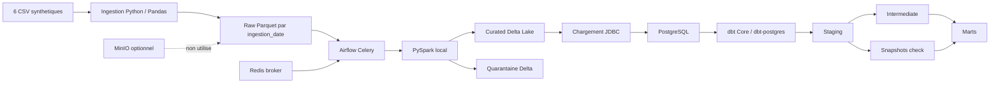

# Architecture technique

## Choix et limites

- **Delta Lake plutot qu'Iceberg :** Delta s'integre directement a l'image PySpark et fournit transactions, MERGE et restauration de version pour les tables locales du projet. Iceberg demanderait un catalogue et des dependances supplementaires pour ce depot.
- **Spark en mode local :** le DAG efface `SPARK_MASTER_URL` sur les traitements pour eviter la surcharge de la VM. Les services master/worker existent encore dans Compose, mais ne participent pas a l'execution actuelle.
- **CeleryExecutor et Redis :** Airflow orchestre seul les traitements; Redis transporte les taches Celery et PostgreSQL conserve les metadonnees Airflow et les tables analytiques.
- **MinIO optionnel :** le profil `minio` est disponible, mais Raw, Delta et warehouse utilisent les volumes locaux montes. Le mettre sous un profil different est deja optionnel; MinIO ne constitue pas le stockage actif.
- **Snapshots dbt en strategie `check` :** les snapshots clients et produits comparent des colonnes de contenu pour historiser les changements sans necessiter de colonne `updated_at` fiable dans toutes les sources.
- **Devises :** les valeurs monétaires restent accompagnees de leur devise. Aucun taux de change ni total inter-devises n'est calcule.
- **Donnees :** seuls les CSV synthetiques du projet doivent etre traites; aucune source client reelle n'est necessaire.

La quarantaine et les tables Delta sont locales et ne fournissent pas de haute disponibilite. Les captures d'execution et les chiffres de reference doivent provenir d'un run effectif, pas de ce schema.
