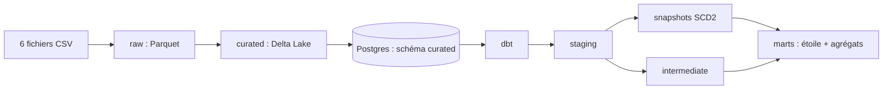

# Guide dbt : la zone analytics d'AfriShop

Ce document explique ce qui a été construit dans `dbt/`, comment le lancer et comment y contribuer. Il est écrit pour quelqu'un qui n'a jamais utilisé dbt.

## 1. Le principe en 5 minutes

Le projet transforme des données brutes en tables prêtes pour l'analyse, en trois zones :



**dbt ne déplace pas de données entre systèmes.** Il exécute des requêtes `SELECT` (un fichier `.sql` = une requête) dans Postgres, et transforme chaque résultat en vue ou en table. On n'écrit jamais de `CREATE TABLE` à la main.

### Vocabulaire

| Terme | Signification |
|---|---|
| **Source** | Table qui existe déjà et que dbt ne crée pas. Ici, le schéma `curated`. |
| **Modèle** | Un fichier `.sql` contenant un `SELECT`. dbt le transforme en vue ou en table du même nom. |
| **`source('curated','orders')`** | Lit une source. |
| **`ref('stg_orders')`** | Lit un autre modèle. dbt en déduit l'ordre d'exécution et le lineage. |
| **Test** | Règle déclarée en YAML (`unique`, `not_null`...). dbt cherche les lignes qui la violent : aucune ligne trouvée = test réussi. |
| **Snapshot** | Historisation d'une table : quand une ligne change, dbt garde l'ancienne version et ajoute la nouvelle (SCD type 2). |
| **Incremental** | Modèle qui ne recalcule que ce qui a changé, au lieu de tout reconstruire. |
| **Matérialisation** | La forme physique d'un modèle : `view`, `table` ou `incremental`. |

## 2. Ce qui est en place

**21 modèles, 2 snapshots, 6 sources, 54 tests.**

### Sources (6)
Déclarées dans `models/staging/_sources.yml`, toutes dans le schéma Postgres `curated` : `orders`, `order_lines`, `customers`, `products`, `payments`, `deliveries`.

### Staging (8 modèles, vues, schéma `staging`)
Rôle : une source = un modèle. On convertit les types, on garde les colonnes utiles, on dédoublonne.

| Modèle | Particularité |
|---|---|
| `stg_orders` | Dédoublonnée avec `row_number()` sur `order_id` (dernier `updated_at` gagne) |
| `stg_order_lines` | Types convertis |
| `stg_customers` | Dédoublonnée sur `customer_id`. Prénom et nom exclus (minimisation des données personnelles) |
| `stg_products` | Types convertis |
| `stg_payments` | Une ligne par tentative de paiement (retries conservés) |
| `stg_deliveries` | Dates vides converties en `NULL` |
| `stg_refunds` | Paiements au statut `REFUNDED` |
| `stg_sellers` | Liste des vendeurs |

### Intermediate (4 modèles, schéma `intermediate`)
Rôle : préparer les règles métier avant les tables finales.

| Modèle | Rôle |
|---|---|
| `int_payments_final` | Une ligne par commande : gère les retries (FAILED puis CAPTURED), montants capturés et remboursés |
| `int_deliveries_by_order` | Une ligne par commande, avec le délai de livraison en jours et le drapeau `is_late` (7 jours ou plus) |
| `int_order_totals` | Contrôle de cohérence : `total_amount = subtotal + shipping - discount`, commandes sans lignes |
| `int_orders_enriched` | Vue d'ensemble d'une commande : paiement, livraison, cohérence, retour |

### Snapshots (2, schéma `snapshots`) : SCD type 2
| Snapshot | Clé | Colonnes surveillées |
|---|---|---|
| `snap_customer` | `customer_id` | `city`, `customer_segment`, `loyalty_tier`, `account_status` |
| `snap_product` | `product_id` | `unit_price`, `unit_cost`, `product_status`, `category_name` |

Quand une valeur surveillée change, l'ancienne ligne reçoit une date dans `dbt_valid_to` et une nouvelle ligne est créée avec `dbt_valid_to` vide (version courante).

### Marts (9 modèles, tables, schéma `marts`)

**Schéma en étoile**

| Table | Grain (1 ligne =) |
|---|---|
| `fact_order_line` | une ligne de commande |
| `dim_customer` | une version d'un client (SCD2) |
| `dim_product` | une version d'un produit (SCD2) |
| `dim_date` | un jour (2025 à 2027) |
| `dim_payment_method` | un mode de paiement |
| `dim_delivery_status` | un statut de livraison |

Les dimensions SCD2 ont une clé de substitution (`customer_key`, `product_key`) et des colonnes `valid_from`, `valid_to`, `is_current`. La première version de chaque entité commence au `1900-01-01`, pour que les commandes anciennes trouvent une version valide. La fact pointe vers la version valide **à la date de la commande**.

**Agrégats incrémentaux**

| Table | Contenu | Stratégie |
|---|---|---|
| `agg_customer_rfm` | Fréquence, montant, dernière commande, par client et par devise | Recalcule les clients dont une commande a changé (`updated_at`) |
| `agg_product_rotation` | Unités vendues, commandes, chiffre d'affaires par produit et par mois | Recalcule les 2 derniers mois |
| `agg_category_return_rate` | Taux de retour par catégorie et par mois | Recalcule les 2 derniers mois |

La fenêtre de 2 mois intègre les arrivées tardives : les retours arrivent plusieurs jours après la commande. Les montants ne sont jamais additionnés entre devises (XOF, GHS, NGN) faute de taux de change.

### Tests (54)
- `unique` et `not_null` sur chaque clé ;
- `relationships` entre tables (commande ↔ lignes, fait ↔ dimensions) ;
- `accepted_values` sur les statuts et modes de paiement ;
- deux tests personnalisés dans `dbt/tests/` en avertissement : `warn_orders_without_lines` et `warn_inconsistent_order_total`.

## 3. Lancer dbt

dbt est installé **dans le conteneur** `airflow-worker`, dans un environnement isolé. Ajoutez ce raccourci à votre terminal (ou à `~/.bashrc`) :

```bash
dbt() { docker compose exec -w /opt/airflow/dbt airflow-worker /home/airflow/dbt_venv/bin/dbt "$@"; }
```

Le dossier `./dbt` est monté dans le conteneur : ce que vous éditez en local est visible tout de suite.

### Ordre d'exécution
Les snapshots lisent le staging, et les dimensions lisent les snapshots. L'ordre compte :

```bash
dbt run --select staging intermediate   # 1. vues et tables de préparation
dbt snapshot                            # 2. historisation SCD2
dbt run --select marts                  # 3. étoile et agrégats
dbt test                                # 4. contrôles
```

Sur une base vierge, lancez d'abord l'étape 1, sinon `dbt snapshot` échoue (les vues n'existent pas encore).

Autres commandes utiles :

| Commande | Effet |
|---|---|
| `dbt run --select stg_orders` | un seul modèle |
| `dbt run --select +fact_order_line` | un modèle et tout ce dont il dépend |
| `dbt run --full-refresh` | reconstruit les modèles incrementals depuis zéro |
| `dbt test --select stg_orders` | tests d'un modèle |
| `dbt test --store-failures` | enregistre les lignes fautives dans des tables |
| `dbt docs generate` | génère la documentation et le lineage |

### Consulter le lineage (documentation dbt)

dbt génère un site de documentation avec le dictionnaire de données et le graphe de dépendances (lineage) entre sources, staging, intermediate, snapshots et marts.

```bash
dbt docs generate                                  # 1. génère les fichiers dans dbt/target/
python3 -m http.server 8085 --directory dbt/target # 2. sert le site depuis votre machine
```

Ouvrez ensuite http://localhost:8085. Pour afficher le graphe, cliquez sur le **bouton vert en bas à droite** de la page. Arrêtez le serveur avec `Ctrl+C`.

Remarques :
- Ouvrir `dbt/target/index.html` directement dans le navigateur ne fonctionne pas : la page charge `manifest.json` et `catalog.json`, ce qui demande un petit serveur web.
- La commande `python3 -m http.server` se lance sur **votre machine**, pas dans le conteneur. Aucun port à ajouter dans `docker-compose.yml`.
- Si le port 8085 est occupé, changez-le (`8086`, `8090`...) et adaptez l'adresse.
- `dbt/target/` n'est pas versionné (il est dans le `.gitignore`). Chaque contributeur régénère le site chez lui.
- La documentation est une photo du projet à un instant donné : relancez `dbt docs generate` après tout ajout ou renommage de modèle.
- Une capture du graphe est conservée dans `docs/img/dbt_lineage.png` pour le README et la soutenance. À refaire si les modèles changent.

## 4. Résultats attendus (jeu de données du sujet)

| Contrôle | Résultat |
|---|---|
| `fact_order_line` | 107 517 lignes |
| `dim_customer` | 81 190 clients (+1 par version supplémentaire) |
| `dim_product` | 12 000 produits |
| Commandes dédoublonnées | 50 500 |
| Tests | tous verts, sauf 3 avertissements voulus (voir ci-dessous) |

### Les avertissements sont voulus
Le jeu de données contient des anomalies injectées exprès. dbt les rend visibles :

| Avertissement | Nombre | Origine |
|---|---|---|
| `product_id` des lignes absent de `products` | 2 108 | Intégrité référentielle violée |
| Commandes dont le total ne correspond pas | 509 | Anomalie « total incohérent » |
| Commandes sans aucune ligne | 500 | Anomalie du jeu de données (dont 287 `DELIVERED`) |

Ces lignes doivent être mises en quarantaine côté curated. Les 3 avertissements ne sont pas des bugs de dbt.

### Définitions métier à connaître
- **Retour** : `order_status = 'RETURNED'` (3 541 commandes). Le remboursement et le retour à l'entrepôt sont deux indicateurs distincts (`has_refund`, `is_returned_to_warehouse`).
- **Livraison tardive** : délai de 7 jours ou plus entre commande et livraison (environ 5 % des livraisons livrées).
- **Retry de paiement** : commande ayant un paiement `FAILED` puis un `CAPTURED` (390).
- **Paiement partiel** : montant capturé strictement inférieur au total de l'en-tête.

## 5. Arborescence

```
dbt/
├── dbt_project.yml          # configuration (matérialisation par dossier)
├── profiles.yml             # connexion Postgres via variables d'environnement
├── macros/
│   └── generate_schema_name.sql   # impose les schémas staging, marts, etc.
├── models/
│   ├── staging/             # _sources.yml, _staging.yml, stg_*.sql
│   ├── intermediate/        # _intermediate.yml, int_*.sql
│   └── marts/               # _marts.yml, dim_*, fact_*, agg_*
├── snapshots/               # snap_customer.sql, snap_product.sql
└── tests/                   # tests personnalisés (avertissements)
```

Aucun mot de passe n'est écrit dans le dépôt : `profiles.yml` lit `WAREHOUSE_DB_*` depuis l'environnement du conteneur (fichier `.env`, non versionné).

## 6. Contribuer

1. Créez une branche : `git checkout -b feature/nom-court`.
2. Modifiez les fichiers de votre zone (`dbt/` pour la modélisation).
3. Lancez `dbt run` puis `dbt test` : aucun test ne doit passer en erreur.
4. Committez en suivant les commits conventionnels : `feat(dbt): ...`, `fix(dbt): ...`, `docs: ...`.
5. Poussez et ouvrez une pull request vers `main`, relue par une autre personne.

Règles de l'équipe :
- Un nouveau modèle s'accompagne de ses tests dans le fichier YAML du dossier.
- Une colonne ajoutée ou renommée dans le curated est annoncée à toute l'équipe (contrat de colonnes).
- On ne modifie pas à la main les tables dbt : elles sont reconstruites à chaque exécution.
- On ne commite jamais `dbt/target/`, `dbt/logs/` ni `.env`.

## 7. Limites actuelles

- **Les données du schéma `curated` ont été importées à la main** depuis les CSV (DBeaver). Elles seront remplacées par la sortie réelle du pipeline Spark/Delta. Aucun modèle dbt n'aura besoin de changer : seules les sources changent de contenu.
- Les modifications de démonstration faites en base (par exemple un client passé en `PLATINUM` pour montrer le SCD2) disparaîtront avec le curated réel.
- Le dédoublonnage de `stg_orders` et `stg_customers` est un filet de sécurité. Le vrai dédoublonnage appartient à la zone curated.
- dbt 1.8 est une version qui ne reçoit plus de patches réguliers. Elle suffit pour ce projet.
- `dbt debug` signale `git [ERROR]`. C'est sans conséquence, git n'est pas installé dans l'image et aucun paquet externe n'est utilisé.

## 8. Dépannage

| Symptôme | Cause et remède |
|---|---|
| `permission denied for table ...` | L'utilisateur `dwh` n'a pas les droits sur les tables de `curated`. Exécuter `GRANT SELECT ON ALL TABLES IN SCHEMA curated TO dwh;` en tant que `postgres` |
| `Nothing to do` | dbt ne trouve aucun modèle : fichiers hors de `dbt/models/`, ou mauvaise extension |
| `relation "curated.xxx" does not exist` | La table source n'est pas chargée |
| `column ... does not exist` | Le nom d'une colonne diffère entre le curated et le modèle staging |
| Échec de `dbt snapshot` sur base vierge | Lancer d'abord `dbt run --select staging` |
| `Permission denied` sur `target/` ou `logs/` | `chmod -R 777 dbt` |
| `dbt run` s'arrête sans message | Souvent un manque de mémoire Docker. Vérifier le code de sortie (`echo $?`, 137 = processus tué) et arrêter les services inutiles |

## 9. Avertissement éthique

Les agrégats RFM et le `loyalty_tier` servent exclusivement à l'analyse. Ils ne doivent **en aucun cas** être utilisés pour exclure des clients ou pratiquer une discrimination tarifaire automatisée. Le jeu de données est synthétique et présente des biais (sur-représentation urbaine, panier moyen variable selon le pays) qui limitent la portée des conclusions. Le projet est pédagogique et ne doit pas être déployé en production sans audit.
